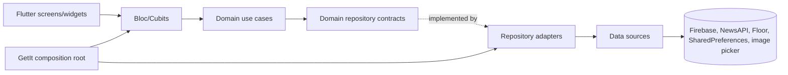
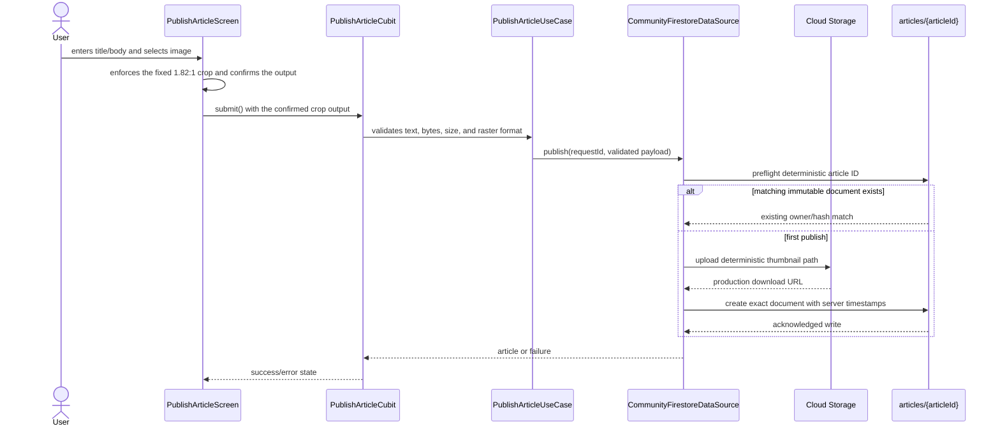

# Case Study Symmetry — Implementation Guide

This guide explains the current architecture, responsibility boundaries, important code paths, and delivery constraints. It is written from the current worktree, not from an attribution assumption. For the file-by-file delta, see [`CHANGE_INVENTORY.md`](CHANGE_INVENTORY.md). For acceptance evidence, see [`REPORT.md`](REPORT.md) and [`proof/README.md`](proof/README.md).

## 1. What was built

The repository contains two deliberately separate article experiences:

1. **Latest News** — the original NewsAPI reader and local bookmark flow.
2. **Community** — Firebase Authentication, a public Firestore feed, authenticated publishing, Cloud Storage thumbnails, immutable article records, realtime likes/comments, and shareable detail links.

Community publishing requires a title, body, and raster image. The image is cropped to the published 1.82:1 presentation ratio before upload. Public readers can read published articles; authenticated users can publish, like, comment, and delete their own comments. The parent article remains immutable.

The current verified delivery target is Flutter Web. Android source/configuration exists but Android builds are unverified because the environment has no Android SDK. iOS is not supported by the current implementation.

## 2. Architecture in one page

The implementation follows a small Clean Architecture boundary:



- **Presentation** owns widgets, routes, form lifecycle, and Cubit state.
- **Domain** owns entities, repository contracts, use cases, and client-side validation.
- **Data** adapts Firebase, NewsAPI, Floor, SharedPreferences, image selection, and sharing APIs.
- **Core/configuration** owns shared result types, Firebase options/runtime selection, routes, and theme.
- **Backend** owns Firestore/Storage rules, indexes, schema, seed validation, and emulator tests.

The dependency direction is inward: presentation depends on domain contracts, while provider-specific code stays in data adapters. GetIt is the composition root and registers concrete implementations under the interfaces consumed by use cases and Cubits.

## 3. Repository map

```text
.
├── README.md                         assignment, delivery status, and quickstart
├── frontend/
│   ├── lib/main.dart                 Firebase initialization, runtime config, DI, runApp
│   ├── lib/injection_container.dart  GetIt composition root
│   ├── lib/config/                   Firebase runtime, routes, theme
│   ├── lib/core/                     shared failures, result types, constants
│   ├── lib/features/auth/            Firebase email/password authentication
│   ├── lib/features/community_articles/
│   │   ├── data/                     Firestore/Storage and image adapters
│   │   ├── domain/                   entities, contracts, use cases
│   │   └── presentation/             feed, detail, publish, social, share
│   ├── lib/features/daily_news/      NewsAPI and local bookmark feature
│   └── test/                         Flutter unit/widget/integration-style tests
├── backend/
│   ├── firebase.json                 named database, emulators, Auth provider
│   ├── firestore.rules               article and social security contract
│   ├── storage.rules                 thumbnail security contract
│   ├── firestore.indexes.json        publishedAt feed index
│   ├── docs/DB_SCHEMA.md             Firestore/Storage/social schema
│   ├── seed/                         12 DEMO article dry-run/apply tooling
│   └── tests/                        emulator security suites and local overlay
├── firebase.hosting.json             root Hosting target and Flutter SPA rewrite
└── docs/
    ├── REPORT.md                     evidence-based report
    ├── CHANGE_INVENTORY.md           changed-file review map
    ├── IMPLEMENTATION_GUIDE.md       this architecture guide
    └── proof/                         images, sampled walkthrough, checksums
```

## 4. Startup, Firebase, DI, and routing

`frontend/lib/main.dart` performs the startup sequence:

```dart
WidgetsFlutterBinding.ensureInitialized();
await Firebase.initializeApp(options: DefaultFirebaseOptions.currentPlatform);
await configureFirebaseRuntime();
await initializeDependencies();
runApp(const MyApp());
```

The order matters. `configureFirebaseRuntime()` must run after Firebase initialization and before data sources are resolved from GetIt. When `USE_FIREBASE_EMULATOR=true`, it configures Auth `9099`, named Firestore `articles` `8080`, and Storage `9199`. Without that define, production Firebase is the runtime.

`frontend/lib/injection_container.dart` registers:

- NewsAPI service/data source/repository/use cases and the original reader Blocs.
- The web-compatible or native local bookmark data source under its interface.
- Firebase Auth data source/repository/use cases and the application `AuthCubit`.
- Community Firestore/Storage data source, article/social repositories, use cases, and Cubit factories.

`frontend/lib/config/routes/routes.dart` maps home, legacy article detail, saved articles, authentication, Community detail, and publishing. It parses `?article=<article-id>` before the ordinary home route, so a shared web URL can resolve a published Community article after a fresh load.

## 5. Community domain and data flow

The main Community contracts live below `frontend/lib/features/community_articles/`:

| Layer | Important files | Responsibility |
| --- | --- | --- |
| Domain entities | `domain/entities/community_article.dart`, `article_comment.dart`, `article_image.dart` | Provider-independent article, comment, and image values |
| Domain contracts | `domain/repository/*.dart` | Read, publish, lookup, like, comment, and delete capabilities |
| Use cases | `domain/usecases/*.dart` | Validation and orchestration without Firebase imports |
| Article data | `data/data_sources/community_firestore_data_source.dart` | Deterministic Storage upload, Firestore create/read, server timestamps |
| Social data | `data/data_sources/community_social_firestore_data_source.dart` | Realtime likes/comments and authenticated writes |
| Repository adapters | `data/repository/*.dart` | Convert provider exceptions into `DataState`/`AppFailure` |
| Presentation | `presentation/bloc/`, `presentation/screens/`, `presentation/widgets/` | Feed, detail, publish, social state, and UI |
| Share service | `presentation/services/article_share_service.dart` | Native share sheet, Web Share, fallback targets, clipboard |

### Publish sequence



The acknowledged Firestore create is the commit boundary. If a convenience read-back fails after the write, the data source returns known local values instead of showing a false failure. Retrying the same request ID and payload hash is idempotent; changing the payload cannot reuse an existing article.

## 6. Authentication and authorization

Firebase email/password authentication is implemented under `frontend/lib/features/auth/`. The UI gate is a usability boundary; Firestore rules are the security boundary:

- Public users can list bounded published Community articles and read valid published details.
- Authenticated users can create an article only when `ownerUid` equals their UID and all fields satisfy the rules.
- Article updates/deletes are denied.
- Likes use the authenticated UID as document ID, so one user has at most one like per article.
- Comments are immutable after creation; an authenticated author can delete only their own comment.
- Comment list queries must include `limit <= 100`; likes remain list-listenable so the UI can derive realtime counts.

See [`backend/docs/DB_SCHEMA.md`](../backend/docs/DB_SCHEMA.md) for field-level contracts and [`backend/firestore.rules`](../backend/firestore.rules) for executable enforcement.

## 7. Realtime social interactions and sharing

`frontend/lib/features/community_articles/presentation/bloc/social_interactions_cubit.dart` subscribes to likes and comments below the current article. It derives the count from the latest likes snapshot and maps comment snapshots to domain entities. Authenticated actions are rejected in the UI when signed out and independently rejected by rules when unauthorized.

`article_share_service.dart` uses platform sharing where available. On web it tries the Web Share API; if the browser cannot use it, the detail screen presents WhatsApp, Telegram, email, and copy-link actions. The copied/shared link uses `?article=<article-id>`, and the route resolves that ID through the public lookup use case.

## 8. Latest News and persistence boundary

NewsAPI remains a separate feature under `frontend/lib/features/daily_news/`:

- `news_api_service.dart` and generated Retrofit code describe the HTTP contract.
- `news_api_data_source.dart` parses the response envelope and maps missing-key/provider/rate-limit errors.
- `article.dart` provides stable bookmark identity, including articles whose URL/ID is null.
- The local data source uses Floor on native platforms and a web-compatible SharedPreferences path on web.

The current source and default web build contain no NewsAPI credential. `NEWS_API_KEY` is an optional local `--dart-define`; Dart embeds any supplied value into the client bundle, so it is not secret storage. The Developer plan is not a hosted-production license. Historical repository data may still contain an old exposed key and its owner must rotate/revoke it. Without a local key, the web build opens Community and Latest remains unavailable by design.

## 9. Firebase schema and operational limits

The parent document is `articles/{articleId}`. It stores the exact immutable fields listed in [`backend/docs/DB_SCHEMA.md`](../backend/docs/DB_SCHEMA.md), including `thumbnailPath`, `urlToImage`, `payloadHash`, `ownerUid`, and server timestamps.

Social subcollections are:

```text
articles/{articleId}/likes/{uid}
  uid, createdAt

articles/{articleId}/comments/{commentId}
  authorUid, authorName, body, createdAt
```

The article feed is bounded to 50 documents and requires the descending `publishedAt` index. Storage thumbnails are required, public-readable at the article path, and owner-only for creation. Rules cannot hash object bytes or coordinate Firestore and Storage as one transaction; a future cleanup job may be needed for a thumbnail uploaded before a permanently failed Firestore create.

## 10. Validation and delivery status

The current reference validation is:

- `flutter analyze`: clean.
- Latest targeted Community/default-key tests: **13 passed**, plus the configured-key test; the full-suite result is **124 passed, 5 skipped**.
- `flutter build web --release`: passed; output `frontend/build/web`.
- Backend: tracked lockfile `npm ci` passes; `npm test` passes **8 grouped security suites**.
- Seed: 12 DEMO articles pass the dry-run and CLI checks without writing by default.
- Live Firebase: Firestore rules, the `publishedAt DESC` index, and Storage rules match the local definitions.
- Hosting: disabled at the applicant’s request; both Firebase Hosting domains returned HTTP 404. The root-level `firebase.hosting.json` is optional configuration, not a delivery requirement.
- Android: unverified because `flutter build apk --debug` stops at `No Android SDK found`.
- iOS: unsupported by the current implementation.

These counts are current delivery evidence. Historical documents or screenshots may contain older counts; the latest values in this guide and the report are authoritative for this worktree.

## 11. Local recipes

### Web app

```bash
cd frontend
flutter pub get
dart run build_runner build --delete-conflicting-outputs
flutter run -d chrome
```

### Backend emulators and tests

```bash
cd backend
npm ci
npx -y firebase-tools@latest emulators:start \
  --project case-study-symmetry \
  --config firebase.json \
  --only auth,firestore,storage
# in another terminal
npm test
node seed/seed-community.mjs
```

### Hosting status and deployment

Firebase Hosting was disabled at the applicant’s request. The earlier public verification is historical evidence only; there is no current live web demo.

Do not deploy without the applicant's explicit authorization. If authorization is granted later, build with `flutter build web --release` and deploy from the repository root with:

```bash
npx -y firebase-tools@latest deploy \
  --only hosting \
  --config firebase.hosting.json \
  --project case-study-symmetry
```

The root-level config targets `frontend/build/web` directly and preserves SPA rewrites for Flutter deep links.

## 12. Navigation order for reviewers

1. `frontend/lib/main.dart` — startup order.
2. `frontend/lib/injection_container.dart` — dependency graph.
3. `frontend/lib/features/community_articles/domain/` — contracts and validation.
4. `frontend/lib/features/community_articles/data/data_sources/community_firestore_data_source.dart` — article persistence.
5. `frontend/lib/features/community_articles/presentation/bloc/publish_article_cubit.dart` — publish state and retry identity.
6. `frontend/lib/features/community_articles/presentation/bloc/social_interactions_cubit.dart` — realtime likes/comments.
7. `frontend/lib/features/community_articles/presentation/services/article_share_service.dart` — native/web/fallback sharing.
8. `backend/firestore.rules` and `backend/storage.rules` — server-side enforcement.
9. `backend/tests/security.test.js` — security evidence.
10. [`CHANGE_INVENTORY.md`](CHANGE_INVENTORY.md) — changed files and review boundaries.
11. [`REPORT.md`](REPORT.md) and [`proof/README.md`](proof/README.md) — evidence and limitations.
